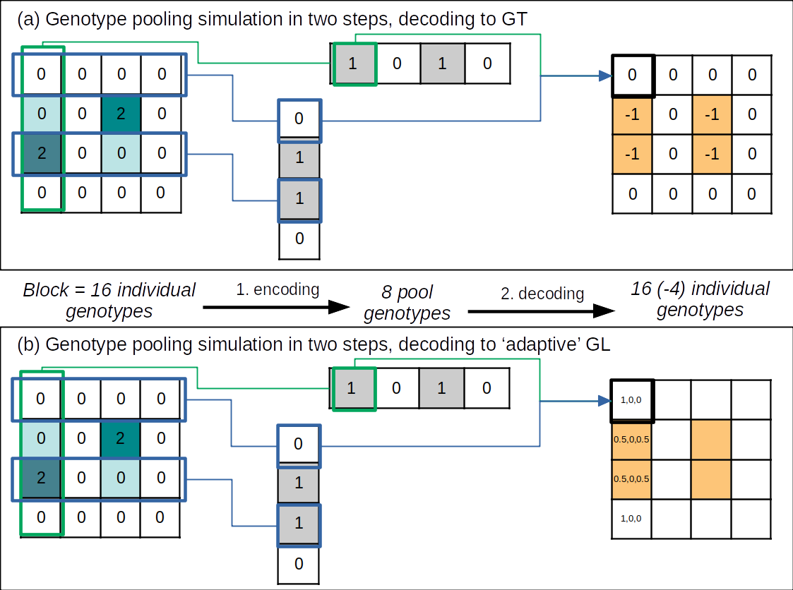

# genotypooler

## Description
This project implements a simulation of SNP genotype pooling with a simple shifted transversal design.
The block size chosen for the pooling design is 4*4, with 8 pools and a design weight of 2.
The encoding and decoding part of the pooling procedure can be represented as follows: 
where {0, 1, 2, -1} are the allelic dosages from the true genotypes values at one SNP of any sample in (a). {0, 1, 2, -1} stand for 
homozygote reference allele, heterozygote, homozygote alternate allele, missing genotype.

Based on a Marginal Likelihood Maximization method, we implemented a refined version of decoding where the missing true genotypes are converted to posterior genotype probabilities 
depending on the position of the sample in the block layout _lambda_ and the pooling pattern _psi_. In the above picture (b),
_lambda_= (0, 2, 1, 0) e.g. allelic dosages of the ambiguous samples after pooling, 
and _psi_=((2, 2, 0), (2, 2, 0)) is the pooling pattern e.g. 2 row-pools have genotype 0, 2 have genotype 1, none has genotype 2, idem for the column-pools.

## Set up
* a Python 3.6 environment with packages listed in [requirements.txt](requirements.txt), e.g. for a Linux-based OS from the **genotypooler** folder:

(if `venv` for Python 3.6 is not installed: `apt install libpython3.6-dev python3.6-venv`)

`/usr/bin/python3.6 -m venv venv3.6`

`source venv3.6/bin/activate`

`pip install --upgrade pip`

`pip install -r requirements.txt`

(see [official venv documentation](https://docs.python.org/3/library/venv.html))

* **bcftools** installed on the OS. See [official page](https://samtools.github.io/bcftools/).

* **tabix**

## Usage
Some data and scripts are provided as use cases in [/examples](/examples). 
In particular, the following files can be found:
* *adaptive_gls.csv*: posterior genotypes probabilities of pooled individuals, computed by Marginal Likelihood Maximization with heterozygotes degeneracy.
* *ALL.chr20.snps.gt.vcf.gz* and its index *.csi*: a subset of 1000 diallelic SNPs on the chromosome 20 for 2504 unrelated individuals from the 1000 Genomes Prject phase3
* *TEST.chr20.snps.gt.vcf.gz* and its index *.csi*: a subset of 100 diallelic SNPs on the chromosome 20 for 240 unrelated individuals from the 1000 Genomes Prject phase3
* *pooling-ex.py*: a minimalistic command-line program for simulating SNPs genotypes pooling from VCF files
* *pooling-imputing-ex.ipynb*: a pipeline showing pooling simulation, imputation in pooled data with Beagle and impuatation quality visualization.

Larger data files can be found in [/data](/data). They can be used the same way as the ones created in examples [/examples](/examples) after executing *pooling-ex.py*.
However the processing needs to be run in parallel on chunked data:
1. From [/data](/data), run `bash ../bin/bcfchunkpara.sh IMP.chr20.snps.gt.vcf.gz ./tmp 1000`. You should get 53 chunks (0 to 52) in a `tmp` folder.
2. From [/runtools](/runtools) run the script *parallel_pooling.py* with `python3 parallel_pooling.py ../data/IMP.chr20.snps.gt.vcf.gz ../data/IMP.chr20.pooled.snps.gl.vcf.gz 4` (if you have 4 cores available on your machine). This should output the pooled file **/data/tmp/IMP.chr20.pooled.snps.gl.vcf.gz**. You can copy this file where you want and delete the **/tmp** folder.

## References
* [DNA Sudoku pooling designs](https://www.ncbi.nlm.nih.gov/pmc/articles/PMC2704425/pdf/1243.pdf/?tool=EBI)
* Beagle 4.1 articles for [phasing](https://linkinghub.elsevier.com/retrieve/pii/S0002929707638828) and [imputation](https://www.cell.com/ajhg/fulltext/S0002-9297(15)00491-7) 
* Beagle 4.1 [documentation and binaries](https://faculty.washington.edu/browning/beagle/b4_1.html)
* The [1000 Genomes Project](https://www.internationalgenome.org/) and its [VCF phase 3 data release](ftp://ftp.1000genomes.ebi.ac.uk/vol1/ftp/release/20130502/).
* Our paper in BMC Bioinformatics: ["A joint use of pooling and imputation for genotyping SNPs"](https://bmcbioinformatics.biomedcentral.com/articles/10.1186/s12859-022-04974-7)